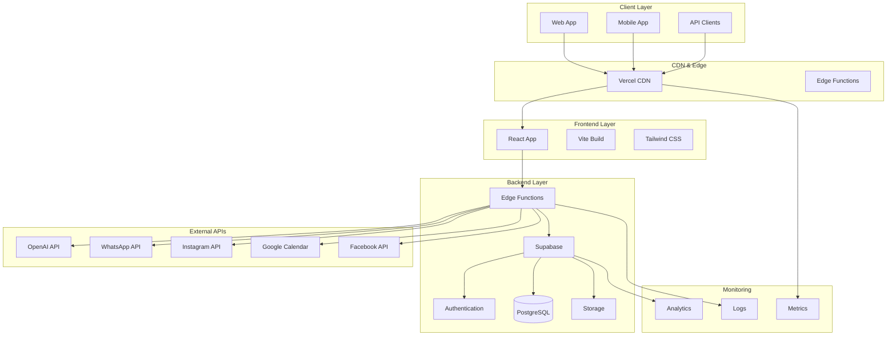

# 🏗️ Arquitetura do Sistema - WiizoChat v2

Documentação completa da arquitetura e design do sistema WiizoChat v2.

## 📋 Índice

- [Visão Geral](#-visão-geral)
- [Arquitetura de Alto Nível](#-arquitetura-de-alto-nível)
- [Frontend Architecture](#-frontend-architecture)
- [Backend Architecture](#-backend-architecture)
- [Database Design](#-database-design)
- [API Design](#-api-design)
- [Security Architecture](#-security-architecture)
- [Performance & Scalability](#-performance--scalability)
- [Monitoring & Observability](#-monitoring--observability)

---

## 🎯 Visão Geral

O WiizoChat v2 é uma plataforma moderna de automação de vendas e atendimento construída com arquitetura de microserviços, utilizando tecnologias de ponta para garantir escalabilidade, performance e confiabilidade.

### **Princípios Arquiteturais**

- **Microserviços:** Separação clara de responsabilidades
- **Serverless:** Edge Functions para escalabilidade automática
- **Event-Driven:** Comunicação assíncrona entre serviços
- **API-First:** Design centrado em APIs
- **Security by Design:** Segurança integrada desde o início

---

## 🏛️ Arquitetura de Alto Nível

### **Diagrama da Arquitetura**



### **Camadas do Sistema**

#### **1. Client Layer**
- **Web Application:** Interface principal em React
- **Mobile App:** Aplicativo móvel (futuro)
- **API Clients:** Integrações externas

#### **2. CDN & Edge Layer**
- **Vercel CDN:** Distribuição global de conteúdo
- **Edge Functions:** Processamento próximo ao usuário

#### **3. Frontend Layer**
- **React 18:** Framework principal
- **Vite:** Build tool e dev server
- **Tailwind CSS:** Sistema de design

#### **4. Backend Layer**
- **Supabase:** Backend-as-a-Service
- **Edge Functions:** Lógica de negócio
- **PostgreSQL:** Banco de dados principal
- **Storage:** Armazenamento de arquivos

#### **5. External APIs**
- **OpenAI:** Inteligência artificial
- **WhatsApp:** Comunicação
- **Instagram:** Redes sociais
- **Google Calendar:** Agendamentos
- **Facebook:** Marketing

---

## ⚛️ Frontend Architecture

### **Estrutura de Pastas**

```
src/
├── components/              # Componentes React
│   ├── ui/                 # Componentes base
│   │   ├── Button.tsx
│   │   ├── Input.tsx
│   │   ├── Modal.tsx
│   │   └── index.ts
│   ├── forms/              # Formulários
│   │   ├── LeadForm.tsx
│   │   ├── ContactForm.tsx
│   │   └── index.ts
│   ├── layout/             # Layout components
│   │   ├── Header.tsx
│   │   ├── Sidebar.tsx
│   │   ├── Footer.tsx
│   │   └── index.ts
│   ├── features/           # Feature components
│   │   ├── chat/
│   │   ├── leads/
│   │   ├── workflows/
│   │   └── campaigns/
│   └── index.ts
├── pages/                  # Páginas da aplicação
│   ├── dashboard/
│   ├── leads/
│   ├── chat/
│   ├── workflows/
│   └── settings/
├── hooks/                  # Custom hooks
│   ├── useAuth.ts
│   ├── useLeads.ts
│   ├── useChat.ts
│   └── index.ts
├── context/                # Context API
│   ├── AuthContext.tsx
│   ├── ThemeContext.tsx
│   └── index.ts
├── services/               # Serviços e APIs
│   ├── api/
│   │   ├── leads.ts
│   │   ├── chat.ts
│   │   ├── workflows.ts
│   │   └── index.ts
│   ├── supabase/
│   │   ├── client.ts
│   │   ├── auth.ts
│   │   └── index.ts
│   └── index.ts
├── utils/                  # Utilitários
│   ├── date.ts
│   ├── validation.ts
│   ├── formatting.ts
│   └── index.ts
├── types/                  # Definições TypeScript
│   ├── auth.ts
│   ├── leads.ts
│   ├── chat.ts
│   └── index.ts
├── constants/              # Constantes
│   ├── api.ts
│   ├── routes.ts
│   └── index.ts
├── lib/                    # Configurações de bibliotecas
│   ├── utils.ts
│   ├── cn.ts
│   └── index.ts
└── App.tsx
```

### **Padrões de Design**

#### **1. Component Composition**
```typescript
// Componente base reutilizável
interface ButtonProps {
  variant?: 'primary' | 'secondary' | 'danger';
  size?: 'sm' | 'md' | 'lg';
  children: React.ReactNode;
  onClick?: () => void;
}

export const Button: React.FC<ButtonProps> = ({
  variant = 'primary',
  size = 'md',
  children,
  onClick,
}) => {
  return (
    <button
      className={cn(
        'rounded-lg font-medium transition-colors',
        buttonVariants({ variant, size })
      )}
      onClick={onClick}
    >
      {children}
    </button>
  );
};
```

#### **2. Custom Hooks**
```typescript
// Hook para gerenciar leads
export const useLeads = () => {
  const [leads, setLeads] = useState<Lead[]>([]);
  const [loading, setLoading] = useState(false);
  const [error, setError] = useState<string | null>(null);

  const fetchLeads = useCallback(async () => {
    setLoading(true);
    try {
      const data = await leadsService.getAll();
      setLeads(data);
    } catch (err) {
      setError(err.message);
    } finally {
      setLoading(false);
    }
  }, []);

  const createLead = useCallback(async (leadData: CreateLeadParams) => {
    try {
      const newLead = await leadsService.create(leadData);
      setLeads(prev => [...prev, newLead]);
      return newLead;
    } catch (err) {
      setError(err.message);
      throw err;
    }
  }, []);

  return {
    leads,
    loading,
    error,
    fetchLeads,
    createLead,
  };
};
```

#### **3. Context Pattern**
```typescript
// Context para autenticação
interface AuthContextType {
  user: User | null;
  loading: boolean;
  signIn: (email: string, password: string) => Promise<void>;
  signOut: () => Promise<void>;
}

export const AuthContext = createContext<AuthContextType | undefined>(undefined);

export const AuthProvider: React.FC<{ children: React.ReactNode }> = ({
  children,
}) => {
  const [user, setUser] = useState<User | null>(null);
  const [loading, setLoading] = useState(true);

  useEffect(() => {
    // Verificar sessão existente
    supabase.auth.getSession().then(({ data: { session } }) => {
      setUser(session?.user ?? null);
      setLoading(false);
    });

    // Escutar mudanças de autenticação
    const {
      data: { subscription },
    } = supabase.auth.onAuthStateChange((_event, session) => {
      setUser(session?.user ?? null);
      setLoading(false);
    });

    return () => subscription.unsubscribe();
  }, []);

  const signIn = async (email: string, password: string) => {
    const { error } = await supabase.auth.signInWithPassword({
      email,
      password,
    });
    if (error) throw error;
  };

  const signOut = async () => {
    const { error } = await supabase.auth.signOut();
    if (error) throw error;
  };

  return (
    <AuthContext.Provider value={{ user, loading, signIn, signOut }}>
      {children}
    </AuthContext.Provider>
  );
};
```

### **State Management**

#### **1. Context API para Estado Global**
- **AuthContext:** Autenticação do usuário
- **ThemeContext:** Tema da aplicação
- **NotificationContext:** Notificações

#### **2. Local State com useState/useReducer**
- Estado específico de componentes
- Formulários complexos
- Estados de UI

#### **3. Server State com React Query**
```typescript
// Configuração do React Query
const queryClient = new QueryClient({
  defaultOptions: {
    queries: {
      staleTime: 5 * 60 * 1000, // 5 minutos
      cacheTime: 10 * 60 * 1000, // 10 minutos
    },
  },
});

// Hook para buscar leads
export const useLeadsQuery = () => {
  return useQuery({
    queryKey: ['leads'],
    queryFn: leadsService.getAll,
    staleTime: 2 * 60 * 1000, // 2 minutos
  });
};
```

---

## 🗄️ Backend Architecture

### **Supabase Edge Functions**

#### **Estrutura das Functions**
```
supabase/functions/
├── openai-proxy/           # Proxy para OpenAI
│   ├── index.ts
│   ├── deno.json
│   └── README.md
├── whatsapp-api/           # API do WhatsApp
│   ├── index.ts
│   ├── deno.json
│   └── README.md
├── webhooks/               # Webhooks personalizados
│   ├── index.ts
│   ├── deno.json
│   └── README.md
├── leads-management/       # Gestão de leads
│   ├── index.ts
│   ├── deno.json
│   └── README.md
└── analytics/              # Analytics e métricas
    ├── index.ts
    ├── deno.json
    └── README.md
```

#### **Exemplo de Edge Function**
```typescript
// supabase/functions/leads-management/index.ts
import { serve } from "https://deno.land/std@0.168.0/http/server.ts"
import { createClient } from 'https://esm.sh/@supabase/supabase-js@2'

const corsHeaders = {
  'Access-Control-Allow-Origin': '*',
  'Access-Control-Allow-Headers': 'authorization, x-client-info, apikey, content-type',
  'Access-Control-Allow-Methods': 'GET, POST, PUT, DELETE, OPTIONS',
}

serve(async (req) => {
  if (req.method === 'OPTIONS') {
    return new Response('ok', { headers: corsHeaders })
  }

  try {
    const supabaseClient = createClient(
      Deno.env.get('SUPABASE_URL') ?? '',
      Deno.env.get('SUPABASE_ANON_KEY') ?? '',
      {
        global: {
          headers: { Authorization: req.headers.get('Authorization')! },
        },
      }
    )

    const { method } = req
    const url = new URL(req.url)
    const pathSegments = url.pathname.split('/').filter(Boolean)
    const leadId = pathSegments[pathSegments.length - 1]

    switch (method) {
      case 'GET':
        if (leadId) {
          // Buscar lead específico
          const { data, error } = await supabaseClient
            .from('leads')
            .select('*')
            .eq('id', leadId)
            .single()

          if (error) throw error

          return new Response(JSON.stringify({ success: true, data }), {
            headers: { ...corsHeaders, 'Content-Type': 'application/json' },
            status: 200,
          })
        } else {
          // Listar leads
          const { data, error } = await supabaseClient
            .from('leads')
            .select('*')
            .order('created_at', { ascending: false })

          if (error) throw error

          return new Response(JSON.stringify({ success: true, data }), {
            headers: { ...corsHeaders, 'Content-Type': 'application/json' },
            status: 200,
          })
        }

      case 'POST':
        // Criar novo lead
        const body = await req.json()
        const { data, error } = await supabaseClient
          .from('leads')
          .insert([body])
          .select()
          .single()

        if (error) throw error

        return new Response(JSON.stringify({ success: true, data }), {
          headers: { ...corsHeaders, 'Content-Type': 'application/json' },
          status: 201,
        })

      case 'PUT':
        // Atualizar lead
        const updateBody = await req.json()
        const { data: updateData, error: updateError } = await supabaseClient
          .from('leads')
          .update(updateBody)
          .eq('id', leadId)
          .select()
          .single()

        if (updateError) throw updateError

        return new Response(JSON.stringify({ success: true, data: updateData }), {
          headers: { ...corsHeaders, 'Content-Type': 'application/json' },
          status: 200,
        })

      case 'DELETE':
        // Excluir lead
        const { error: deleteError } = await supabaseClient
          .from('leads')
          .delete()
          .eq('id', leadId)

        if (deleteError) throw deleteError

        return new Response(JSON.stringify({ success: true, message: 'Lead excluído' }), {
          headers: { ...corsHeaders, 'Content-Type': 'application/json' },
          status: 200,
        })

      default:
        return new Response(JSON.stringify({ error: 'Method not allowed' }), {
          headers: { ...corsHeaders, 'Content-Type': 'application/json' },
          status: 405,
        })
    }
  } catch (error) {
    return new Response(JSON.stringify({ 
      success: false, 
      error: error.message 
    }), {
      headers: { ...corsHeaders, 'Content-Type': 'application/json' },
      status: 500,
    })
  }
})
```

### **Database Design**

#### **Schema Principal**
```sql
-- Tabela de usuários
CREATE TABLE users (
  id UUID PRIMARY KEY DEFAULT gen_random_uuid(),
  email VARCHAR(255) UNIQUE NOT NULL,
  full_name VARCHAR(255),
  avatar_url TEXT,
  role VARCHAR(50) DEFAULT 'user',
  company_id UUID REFERENCES companies(id),
  created_at TIMESTAMP WITH TIME ZONE DEFAULT NOW(),
  updated_at TIMESTAMP WITH TIME ZONE DEFAULT NOW()
);

-- Tabela de empresas
CREATE TABLE companies (
  id UUID PRIMARY KEY DEFAULT gen_random_uuid(),
  name VARCHAR(255) NOT NULL,
  domain VARCHAR(255),
  settings JSONB DEFAULT '{}',
  created_at TIMESTAMP WITH TIME ZONE DEFAULT NOW(),
  updated_at TIMESTAMP WITH TIME ZONE DEFAULT NOW()
);

-- Tabela de leads
CREATE TABLE leads (
  id UUID PRIMARY KEY DEFAULT gen_random_uuid(),
  company_id UUID REFERENCES companies(id) NOT NULL,
  user_id UUID REFERENCES users(id),
  name VARCHAR(255) NOT NULL,
  email VARCHAR(255),
  phone VARCHAR(50),
  company VARCHAR(255),
  source VARCHAR(100),
  pipeline VARCHAR(100) DEFAULT 'novos-leads',
  status VARCHAR(50) DEFAULT 'novo',
  score INTEGER DEFAULT 0,
  custom_fields JSONB DEFAULT '{}',
  notes TEXT,
  created_at TIMESTAMP WITH TIME ZONE DEFAULT NOW(),
  updated_at TIMESTAMP WITH TIME ZONE DEFAULT NOW()
);

-- Tabela de conversas
CREATE TABLE conversations (
  id UUID PRIMARY KEY DEFAULT gen_random_uuid(),
  lead_id UUID REFERENCES leads(id),
  channel VARCHAR(50) NOT NULL, -- whatsapp, instagram, facebook
  status VARCHAR(50) DEFAULT 'active',
  metadata JSONB DEFAULT '{}',
  created_at TIMESTAMP WITH TIME ZONE DEFAULT NOW(),
  updated_at TIMESTAMP WITH TIME ZONE DEFAULT NOW()
);

-- Tabela de mensagens
CREATE TABLE messages (
  id UUID PRIMARY KEY DEFAULT gen_random_uuid(),
  conversation_id UUID REFERENCES conversations(id) NOT NULL,
  role VARCHAR(20) NOT NULL, -- user, assistant, system
  content TEXT NOT NULL,
  metadata JSONB DEFAULT '{}',
  created_at TIMESTAMP WITH TIME ZONE DEFAULT NOW()
);

-- Tabela de workflows
CREATE TABLE workflows (
  id UUID PRIMARY KEY DEFAULT gen_random_uuid(),
  company_id UUID REFERENCES companies(id) NOT NULL,
  name VARCHAR(255) NOT NULL,
  description TEXT,
  status VARCHAR(50) DEFAULT 'draft',
  nodes JSONB NOT NULL DEFAULT '[]',
  created_at TIMESTAMP WITH TIME ZONE DEFAULT NOW(),
  updated_at TIMESTAMP WITH TIME ZONE DEFAULT NOW()
);

-- Tabela de agentes de IA
CREATE TABLE ai_agents (
  id UUID PRIMARY KEY DEFAULT gen_random_uuid(),
  company_id UUID REFERENCES companies(id) NOT NULL,
  name VARCHAR(255) NOT NULL,
  description TEXT,
  type VARCHAR(50) DEFAULT 'custom',
  system_prompt TEXT,
  temperature DECIMAL(3,2) DEFAULT 0.7,
  max_tokens INTEGER DEFAULT 1000,
  tools_config JSONB DEFAULT '{}',
  created_at TIMESTAMP WITH TIME ZONE DEFAULT NOW(),
  updated_at TIMESTAMP WITH TIME ZONE DEFAULT NOW()
);
```

#### **Índices para Performance**
```sql
-- Índices para leads
CREATE INDEX idx_leads_company_id ON leads(company_id);
CREATE INDEX idx_leads_status ON leads(status);
CREATE INDEX idx_leads_pipeline ON leads(pipeline);
CREATE INDEX idx_leads_created_at ON leads(created_at);
CREATE INDEX idx_leads_email ON leads(email);
CREATE INDEX idx_leads_phone ON leads(phone);

-- Índices para conversas
CREATE INDEX idx_conversations_lead_id ON conversations(lead_id);
CREATE INDEX idx_conversations_channel ON conversations(channel);
CREATE INDEX idx_conversations_status ON conversations(status);

-- Índices para mensagens
CREATE INDEX idx_messages_conversation_id ON messages(conversation_id);
CREATE INDEX idx_messages_created_at ON messages(created_at);

-- Índices para workflows
CREATE INDEX idx_workflows_company_id ON workflows(company_id);
CREATE INDEX idx_workflows_status ON workflows(status);

-- Índices para agentes
CREATE INDEX idx_ai_agents_company_id ON ai_agents(company_id);
CREATE INDEX idx_ai_agents_type ON ai_agents(type);
```

#### **Políticas RLS (Row Level Security)**
```sql
-- Habilitar RLS
ALTER TABLE leads ENABLE ROW LEVEL SECURITY;
ALTER TABLE conversations ENABLE ROW LEVEL SECURITY;
ALTER TABLE messages ENABLE ROW LEVEL SECURITY;
ALTER TABLE workflows ENABLE ROW LEVEL SECURITY;
ALTER TABLE ai_agents ENABLE ROW LEVEL SECURITY;

-- Políticas para leads
CREATE POLICY "Users can view leads from their company" ON leads
  FOR SELECT USING (
    company_id IN (
      SELECT company_id FROM users WHERE id = auth.uid()
    )
  );

CREATE POLICY "Users can insert leads in their company" ON leads
  FOR INSERT WITH CHECK (
    company_id IN (
      SELECT company_id FROM users WHERE id = auth.uid()
    )
  );

CREATE POLICY "Users can update leads from their company" ON leads
  FOR UPDATE USING (
    company_id IN (
      SELECT company_id FROM users WHERE id = auth.uid()
    )
  );

-- Políticas para conversas
CREATE POLICY "Users can view conversations from their company" ON conversations
  FOR SELECT USING (
    lead_id IN (
      SELECT id FROM leads WHERE company_id IN (
        SELECT company_id FROM users WHERE id = auth.uid()
      )
    )
  );

-- Políticas para mensagens
CREATE POLICY "Users can view messages from their company" ON messages
  FOR SELECT USING (
    conversation_id IN (
      SELECT id FROM conversations WHERE lead_id IN (
        SELECT id FROM leads WHERE company_id IN (
          SELECT company_id FROM users WHERE id = auth.uid()
        )
      )
    )
  );
```

---

## 🔌 API Design

### **Padrões RESTful**

#### **1. Estrutura de URLs**
```
GET    /api/leads              # Listar leads
GET    /api/leads/{id}         # Buscar lead específico
POST   /api/leads              # Criar lead
PUT    /api/leads/{id}         # Atualizar lead
DELETE /api/leads/{id}         # Excluir lead

GET    /api/conversations      # Listar conversas
GET    /api/conversations/{id} # Buscar conversa específica
POST   /api/conversations      # Criar conversa
PUT    /api/conversations/{id} # Atualizar conversa

GET    /api/messages           # Listar mensagens
POST   /api/messages           # Enviar mensagem
```

#### **2. Estrutura de Resposta**
```typescript
// Resposta de sucesso
interface ApiResponse<T> {
  success: true;
  data: T;
  message?: string;
  timestamp: string;
}

// Resposta de erro
interface ApiError {
  success: false;
  error: {
    code: string;
    message: string;
    details?: any;
  };
  timestamp: string;
}

// Exemplo de uso
const response: ApiResponse<Lead[]> = {
  success: true,
  data: [
    {
      id: "lead_123",
      name: "João Silva",
      email: "joao@email.com",
      // ... outros campos
    }
  ],
  message: "Leads carregados com sucesso",
  timestamp: "2024-01-15T10:30:00Z"
};
```

#### **3. Paginação**
```typescript
interface PaginatedResponse<T> {
  success: true;
  data: T[];
  pagination: {
    page: number;
    limit: number;
    total: number;
    pages: number;
    hasNext: boolean;
    hasPrev: boolean;
  };
}

// Query parameters
interface PaginationParams {
  page?: number;    // Página (padrão: 1)
  limit?: number;   // Limite por página (padrão: 20)
  sort?: string;    // Campo para ordenação
  order?: 'asc' | 'desc'; // Direção da ordenação
}
```

### **Rate Limiting**

#### **Configuração por Endpoint**
```typescript
const rateLimits = {
  '/api/leads': {
    requests: 500,
    window: '1h',
    burst: 100
  },
  '/api/conversations': {
    requests: 300,
    window: '1h',
    burst: 50
  },
  '/api/openai-proxy': {
    requests: 1000,
    window: '1h',
    burst: 200
  }
};
```

#### **Headers de Rate Limit**
```http
X-RateLimit-Limit: 500
X-RateLimit-Remaining: 499
X-RateLimit-Reset: 1642249200
X-RateLimit-Retry-After: 3600
```

---

## 🔒 Security Architecture

### **Autenticação e Autorização**

#### **1. JWT Tokens**
```typescript
// Estrutura do JWT
interface JWTPayload {
  sub: string;        // User ID
  email: string;      // User email
  role: string;       // User role
  company_id: string; // Company ID
  iat: number;        // Issued at
  exp: number;        // Expires at
}
```

#### **2. Row Level Security (RLS)**
```sql
-- Exemplo de política RLS
CREATE POLICY "Users can only access their company's data" ON leads
  FOR ALL USING (
    company_id = (
      SELECT company_id FROM users WHERE id = auth.uid()
    )
  );
```

#### **3. API Key Authentication**
```typescript
// Validação de API Key
const validateApiKey = async (apiKey: string) => {
  const { data, error } = await supabase
    .from('api_keys')
    .select('*')
    .eq('key', apiKey)
    .eq('active', true)
    .single();

  if (error || !data) {
    throw new Error('Invalid API key');
  }

  return data;
};
```

### **Proteções de Segurança**

#### **1. CORS Configuration**
```typescript
const corsHeaders = {
  'Access-Control-Allow-Origin': process.env.ALLOWED_ORIGINS || '*',
  'Access-Control-Allow-Headers': 'authorization, x-client-info, apikey, content-type',
  'Access-Control-Allow-Methods': 'GET, POST, PUT, DELETE, OPTIONS',
  'Access-Control-Max-Age': '86400',
};
```

#### **2. Input Validation**
```typescript
import { z } from 'zod';

const createLeadSchema = z.object({
  name: z.string().min(1).max(255),
  email: z.string().email().optional(),
  phone: z.string().regex(/^\+?[1-9]\d{1,14}$/).optional(),
  company: z.string().max(255).optional(),
  source: z.string().max(100).optional(),
  pipeline: z.string().max(100).default('novos-leads'),
  custom_fields: z.record(z.any()).optional(),
});

const validateCreateLead = (data: unknown) => {
  return createLeadSchema.parse(data);
};
```

#### **3. Rate Limiting**
```typescript
// Implementação de rate limiting
const rateLimitMap = new Map<string, { count: number; resetTime: number }>();

const rateLimit = (key: string, limit: number, window: number) => {
  const now = Date.now();
  const record = rateLimitMap.get(key);

  if (!record || now > record.resetTime) {
    rateLimitMap.set(key, { count: 1, resetTime: now + window });
    return true;
  }

  if (record.count >= limit) {
    return false;
  }

  record.count++;
  return true;
};
```

---

## ⚡ Performance & Scalability

### **Frontend Performance**

#### **1. Code Splitting**
```typescript
// Lazy loading de componentes
const LeadsPage = lazy(() => import('./pages/LeadsPage'));
const ChatPage = lazy(() => import('./pages/ChatPage'));
const WorkflowsPage = lazy(() => import('./pages/WorkflowsPage'));

// Uso com Suspense
<Suspense fallback={<LoadingSpinner />}>
  <Routes>
    <Route path="/leads" element={<LeadsPage />} />
    <Route path="/chat" element={<ChatPage />} />
    <Route path="/workflows" element={<WorkflowsPage />} />
  </Routes>
</Suspense>
```

#### **2. Memoization**
```typescript
// Memoização de componentes
const LeadCard = memo(({ lead }: { lead: Lead }) => {
  return (
    <div className="lead-card">
      <h3>{lead.name}</h3>
      <p>{lead.email}</p>
    </div>
  );
});

// Memoização de valores computados
const filteredLeads = useMemo(() => {
  return leads.filter(lead => 
    lead.name.toLowerCase().includes(searchTerm.toLowerCase())
  );
}, [leads, searchTerm]);
```

#### **3. Virtual Scrolling**
```typescript
// Para listas grandes
import { FixedSizeList as List } from 'react-window';

const LeadsList = ({ leads }: { leads: Lead[] }) => {
  const Row = ({ index, style }: { index: number; style: any }) => (
    <div style={style}>
      <LeadCard lead={leads[index]} />
    </div>
  );

  return (
    <List
      height={600}
      itemCount={leads.length}
      itemSize={80}
      width="100%"
    >
      {Row}
    </List>
  );
};
```

### **Backend Performance**

#### **1. Database Optimization**
```sql
-- Índices compostos para queries complexas
CREATE INDEX idx_leads_company_status ON leads(company_id, status);
CREATE INDEX idx_leads_company_pipeline ON leads(company_id, pipeline);
CREATE INDEX idx_messages_conversation_created ON messages(conversation_id, created_at);

-- Partial indexes para queries específicas
CREATE INDEX idx_active_leads ON leads(company_id) WHERE status = 'active';
CREATE INDEX idx_recent_messages ON messages(created_at) WHERE created_at > NOW() - INTERVAL '7 days';
```

#### **2. Caching Strategy**
```typescript
// Cache em memória para dados frequentes
const cache = new Map<string, { data: any; expires: number }>();

const getCachedData = (key: string) => {
  const cached = cache.get(key);
  if (cached && cached.expires > Date.now()) {
    return cached.data;
  }
  return null;
};

const setCachedData = (key: string, data: any, ttl: number = 300000) => {
  cache.set(key, {
    data,
    expires: Date.now() + ttl
  });
};
```

#### **3. Connection Pooling**
```typescript
// Configuração do pool de conexões
const poolConfig = {
  max: 20,           // Máximo de conexões
  min: 5,            // Mínimo de conexões
  acquireTimeoutMillis: 30000,
  createTimeoutMillis: 30000,
  destroyTimeoutMillis: 5000,
  idleTimeoutMillis: 30000,
  reapIntervalMillis: 1000,
  createRetryIntervalMillis: 200,
};
```

### **Scalability Patterns**

#### **1. Horizontal Scaling**
- **Edge Functions:** Escalam automaticamente
- **Database:** Read replicas para queries
- **CDN:** Distribuição global de conteúdo

#### **2. Microservices Architecture**
```typescript
// Serviço de leads
class LeadsService {
  async createLead(data: CreateLeadParams): Promise<Lead> {
    // Lógica específica de leads
  }
}

// Serviço de conversas
class ConversationsService {
  async createConversation(data: CreateConversationParams): Promise<Conversation> {
    // Lógica específica de conversas
  }
}

// Serviço de workflows
class WorkflowsService {
  async executeWorkflow(workflowId: string, data: any): Promise<void> {
    // Lógica específica de workflows
  }
}
```

---

## 📊 Monitoring & Observability

### **Logging Strategy**

#### **1. Structured Logging**
```typescript
interface LogEntry {
  timestamp: string;
  level: 'debug' | 'info' | 'warn' | 'error';
  message: string;
  context?: Record<string, any>;
  userId?: string;
  requestId?: string;
}

const logger = {
  debug: (message: string, context?: any) => {
    console.log(JSON.stringify({
      timestamp: new Date().toISOString(),
      level: 'debug',
      message,
      context
    }));
  },
  
  info: (message: string, context?: any) => {
    console.log(JSON.stringify({
      timestamp: new Date().toISOString(),
      level: 'info',
      message,
      context
    }));
  },
  
  error: (message: string, error?: Error, context?: any) => {
    console.error(JSON.stringify({
      timestamp: new Date().toISOString(),
      level: 'error',
      message,
      error: error?.stack,
      context
    }));
  }
};
```

#### **2. Request Tracing**
```typescript
// Middleware para tracing
const traceRequest = (req: Request) => {
  const requestId = crypto.randomUUID();
  const startTime = Date.now();
  
  req.headers.set('X-Request-ID', requestId);
  
  return {
    requestId,
    startTime,
    endTrace: () => {
      const duration = Date.now() - startTime;
      logger.info('Request completed', {
        requestId,
        duration,
        method: req.method,
        url: req.url
      });
    }
  };
};
```

### **Metrics Collection**

#### **1. Application Metrics**
```typescript
// Métricas de performance
const metrics = {
  requests: {
    total: 0,
    successful: 0,
    failed: 0,
    duration: [] as number[]
  },
  
  database: {
    queries: 0,
    slowQueries: 0,
    connectionPool: {
      active: 0,
      idle: 0
    }
  },
  
  external: {
    openai: {
      requests: 0,
      tokens: 0,
      cost: 0
    },
    whatsapp: {
      messages: 0,
      errors: 0
    }
  }
};
```

#### **2. Health Checks**
```typescript
// Endpoint de health check
const healthCheck = async () => {
  const checks = {
    database: await checkDatabase(),
    redis: await checkRedis(),
    external_apis: await checkExternalAPIs()
  };
  
  const isHealthy = Object.values(checks).every(check => check.status === 'ok');
  
  return {
    status: isHealthy ? 'healthy' : 'unhealthy',
    timestamp: new Date().toISOString(),
    checks
  };
};
```

### **Error Handling**

#### **1. Global Error Handler**
```typescript
// Handler global de erros
const globalErrorHandler = (error: Error, context?: any) => {
  logger.error('Unhandled error', error, context);
  
  // Enviar para serviço de monitoramento
  if (process.env.NODE_ENV === 'production') {
    // Sentry, DataDog, etc.
    sendToMonitoring(error, context);
  }
  
  // Retornar resposta de erro padronizada
  return new Response(JSON.stringify({
    success: false,
    error: {
      code: 'INTERNAL_SERVER_ERROR',
      message: 'An unexpected error occurred'
    }
  }), {
    status: 500,
    headers: { 'Content-Type': 'application/json' }
  });
};
```

#### **2. Error Boundaries (Frontend)**
```typescript
// Error boundary para React
class ErrorBoundary extends React.Component<
  { children: React.ReactNode },
  { hasError: boolean; error?: Error }
> {
  constructor(props: any) {
    super(props);
    this.state = { hasError: false };
  }

  static getDerivedStateFromError(error: Error) {
    return { hasError: true, error };
  }

  componentDidCatch(error: Error, errorInfo: React.ErrorInfo) {
    logger.error('React Error Boundary', error, {
      componentStack: errorInfo.componentStack
    });
  }

  render() {
    if (this.state.hasError) {
      return <ErrorFallback error={this.state.error} />;
    }

    return this.props.children;
  }
}
```

---

## 📚 Recursos Adicionais

### **Documentação Técnica**
- [Guia de Setup](SETUP.md)
- [Documentação da API](API.md)
- [Guia de Deploy](DEPLOYMENT.md)
- [Guia de Contribuição](../CONTRIBUTING.md)

### **Ferramentas e Bibliotecas**
- [React 18](https://react.dev/)
- [Vite](https://vitejs.dev/)
- [Tailwind CSS](https://tailwindcss.com/)
- [Supabase](https://supabase.com/)
- [TypeScript](https://www.typescriptlang.org/)

### **Padrões e Boas Práticas**
- [Clean Architecture](https://blog.cleancoder.com/uncle-bob/2012/08/13/the-clean-architecture.html)
- [Domain-Driven Design](https://martinfowler.com/bliki/DomainDrivenDesign.html)
- [Microservices Patterns](https://microservices.io/)

---

**Última atualização:** Janeiro 2024
